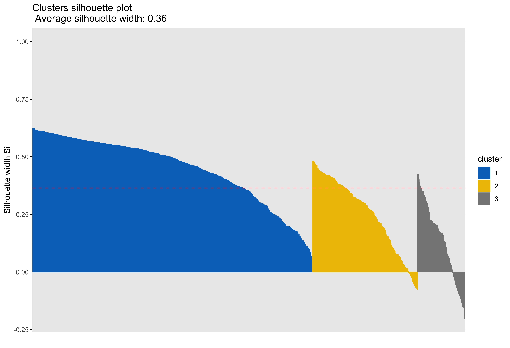
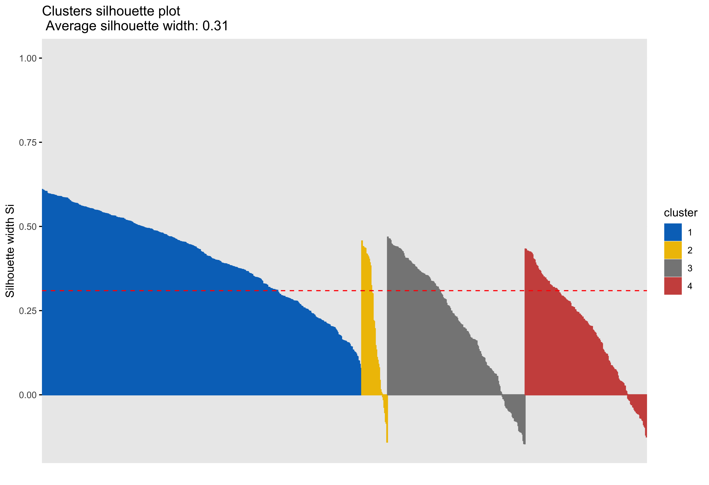

```{r setup, include=FALSE}
library(here)
library(knitr)
library(purrr)
library(ggplot2)
library(factoextra)
knitr::opts_chunk$set(echo = FALSE, eval = TRUE)
```

# Background information
All analyses were conducted using R (R Core Team, 2018).

```
platform       x86_64-apple-darwin15.6.0   
arch           x86_64                      
os             darwin15.6.0                
system         x86_64, darwin15.6.0        
status                                     
major          3                           
minor          5.1                         
year           2018                        
month          07                          
day            02                          
svn rev        74947                       
language       R                           
version.string R version 3.5.1 (2018-07-02)
nickname       Feather Spray        
```

**Variables included in the analysis**

- `threatbias_erlab`  
- `vigilance_erlab`  
- `disengage_erlab` (removed prior to clustering)
- `rt_threat_nt`  
- `variability`  

# Pre-processing
## Outliers and missingness
Outliers were already removed from the data by our collaborators based on the percentage of trials that were answered correctly. Participants with an accuracy of .80 or greater are included in the dataset. There are no initial missing data for the dot probe measures as the included metrics can be computed for anyone who completed the task. 

## Zero and near zero variance
All variables were checked for zero or near zero variance and no issues were found.  

## Linear dependencies
`disengage_erlab` is a linear combination of `threatbias_erlab` and `vigilance_erlab`. `disengage_erlab` was therefore not included in the clustering analysis.

```
 disengage = threat_bias - vigilance
```

## Standardization/Scaling

Clustering is sensitive to differences in the measurement scales of data. Since the means and standard deviations do vary across features, we standardized them by mean centering Using the `scale()` function (see Table 1). Variables are scaled to mean = 0, sd = 1.  

```{r}
load(here("output", "data_means_bias.Rda"))
kable(data_means_bias, digits = 2,
      caption = "Table 1. Comparison of Means for Threat Bias Variables Before and After Scaling")
```

## Dimensionality Reduction, Principal Components Analysis  
**Purpose: prevent overfitting of the data and improve interpretability**

Principal Components Analysis (PCA) is a dimensionality reduction technique that can be used as a precursor to k-means clustering (Zha, et al., 2002; Ding & He, 2004). PCA projects high dimensional data onto a lower dimensional sub-space and rotates data to mazimize variance in the new axes. The components are then listed in order of  decreasing variance (e.g. component 1 has the most variation in the data, component 2 is orthogonal to component 1 and has the most remaining variation, and so on). PCA is an unsuprevised technique that can be used when we do not have hypotheses about the distribution of varaince across features.   


```{r}
load(here("output", "data_pcasummary_bias.Rda"))
kable(pca_summary_bias$importance, digits = 2, 
      caption = 'Table 2. PCA Summary Table, Threat Bias Dataset')
```

Based on the cumulative proportion of variance accounted for by each principal component, the 3-component solution is selected for use in the clustering analysis as it is the point at which more than 90% of the variance in the data can be acounted for (see Table 2).  

# K-means clustering
K-means is a centroid based clustering approach that groups data points around a central point to minimize within group distance and maximize between group distance. To help determine the number of clusters to use, k-means is run with 2 through 4 clusters. 

## Scatterplots of clustering by variable
```{r}
load(here("output", "data_bias.Rda"))
load(here("output", "km_data_pca3_bias.Rda"))
purrr::walk(km_data_pca3_bias, ~plot(data_bias[,], col = .x$cluster))
```

## Boxplots by variable


## Silhouette plots






# Summary

The clustering analysis was performed using the threat bias variables `threatbias_erlab` and `vigilance_erlab`, as well as the response time variable `rt_threat_nt` and the variability variable `variability`. As mentioned in the preprocessing section, `disengage_erlab` does not provide useful information for development of a clustering solution, nor its interpretation as the variable is a linear combination of `threatbias_erlab` and `vigilance_erlab`. The clustering results are similar to those of the previous clustering analysis conducted on the response time variables in that response time is the predominent feature on which data are clustered.  

The main difference between clusters within solutions appears to relate to response time and threat bias scores, as evidenced by the boxplots and scatterplots (see above plots). As can be seen in the silhouette plots, cluster 1 is the largest in all of the clustering solutions, reflecting generally faster response times. In the 2 cluster solution, cluster 1 members have a generally faster response time and higher threat bias scores. Cluster 2 of the 2 cluster solution contains observations with generally slower response times and lower threat bias scores. Cluster 1 is most people. In the 3 cluster solution, there is also a small 3rd cluster that consists of slower response times and higher threat bias scores. Both the 2 and 3 cluster solutions are equally “good”. The 4 cluster solution  appears to break out the fourth cluster based on long response times. Any of the solutions are viable options, though the 2 and 3 cluster solutions are likely more easily interpretable and the fewer clusters there are the fewer observations fit poorly within them (see the number of negative silhouette observations in table 3). Overall clustering solution fit measures are presented in table 3 and see table 4 for summary measures of fit by cluster within each clustering solution.  

```{r}
make_table3 <- function(data) {
    df <- NULL
    for (i in seq_along(data)) {
        total_within_cluster_ss <- data[[i]]$tot.withinss  # total
        total_between_cluster_ss <- data[[i]]$betweenss  # total between ss
        clustering_solution <- data[[i]]$nbclust  # total number of clusters
        average_silhouette_coefficient <- data[[i]]$silinfo$avg.width  # total sil 
        negative_silhouette <- length(which(data[[i]]$silinfo$widths[, "sil_width"] < 0))  # total neg observations
        
        temp <- cbind(clustering_solution, total_within_cluster_ss, total_between_cluster_ss, average_silhouette_coefficient, negative_silhouette)
        df <- rbind(df, temp)
    }
    kable(df, digits = 2, caption = "Table 3. Clustering Solution Summary Statistics: by Clustering Solition")
}

make_table3(km_data_pca3_bias)


make_table4 <- function(data) {
    df <- NULL
    for (i in seq_along(data)) {
        clustering_solution <-  data[[i]]$nbclust # total number of clusters
        clustering_solution <- rep(clustering_solution, clustering_solution)
        cluster <- seq_along(1:data[[i]]$nbclust)
        within_cluster_ss <- data[[i]]$withinss  # per clust
        observations_per_cluster <- data[[i]]$size  # observations per clust
        average_silhouette_width <- data[[i]]$silinfo$clus.avg.widths  # per clust
        
        temp <- cbind(clustering_solution, cluster, observations_per_cluster, within_cluster_ss, average_silhouette_width)
        df <- rbind(df, temp)
    }
    kable(df, digits = 2, caption = "Table 4. Clustering Solution Summary Statistics: by Cluster, Within Clustering Solition")
}

make_table4(km_data_pca3_bias)
```
